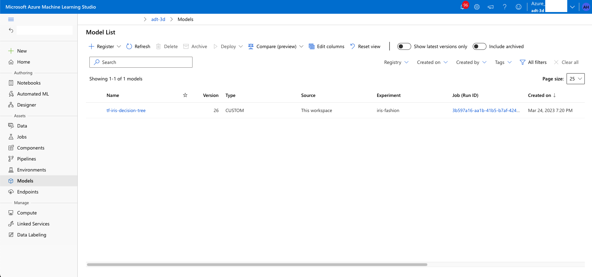
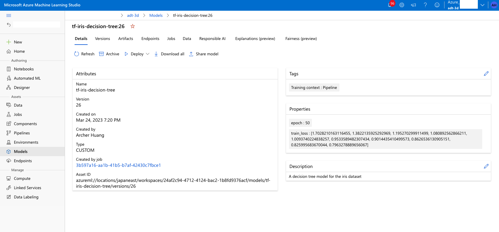
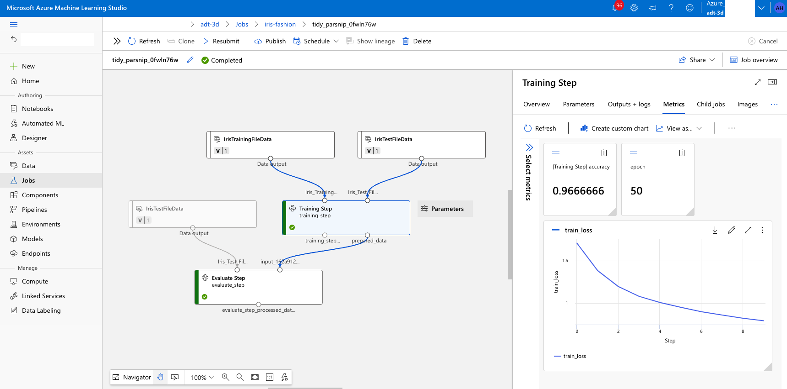
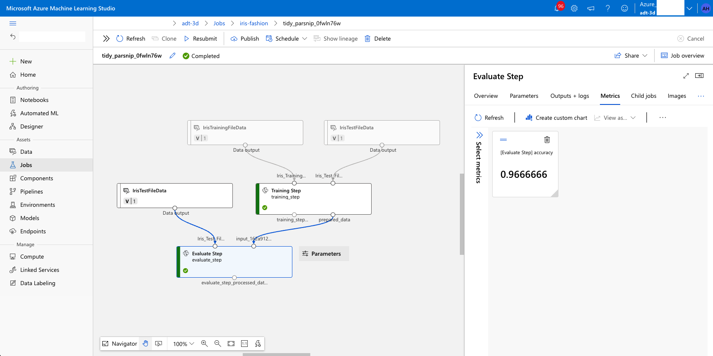
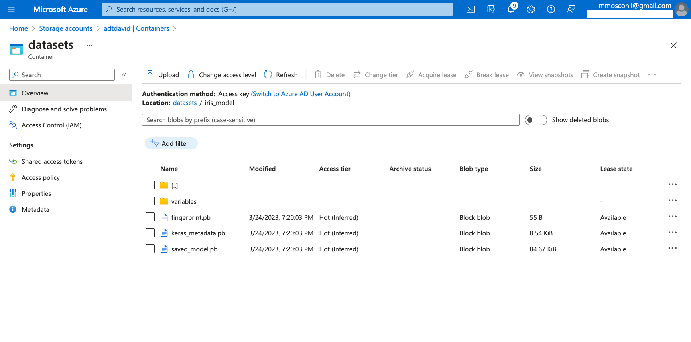

# AzureML Using Pipeline, Tensorflow, Keras and Docker with Iris as an Example
## Contents
- [The file structure in the Github repository](#the-file-structure-in-the-github-repository)
- [Models](#models)
- [Pipeline Jobs Metrics](#pipeline-jobs-metrics)
  - Jobs
  - Metrics
- [Blob](#blob)
- [License](#license)

## The file structure in the Github repository
```
├── AzureML
│   ├── pipeline-python
│   │   ├── evaluate.py
│   │   └── training.py
│   └── run_iris_pipeline.ipynb
├── Blob
│   └── UploadFiles
│       ├── Log
│       │   └── L20230218.log
│       ├── app.py
│       └── requirements.txt
├── Datasets
│   ├── test
│   │   └── iris_test.csv
│   └── training
│       └── iris_training.csv
├── LICENSE
└── README.md
```
## Models




## Pipeline Jobs Metrics
* Jobs


* Metrics
  * Training Step
    
  * Evaluate Step
    

## Blob




## License
Examples of Azure Digital Twins is licensed under the [MIT](./LICENSE) license.