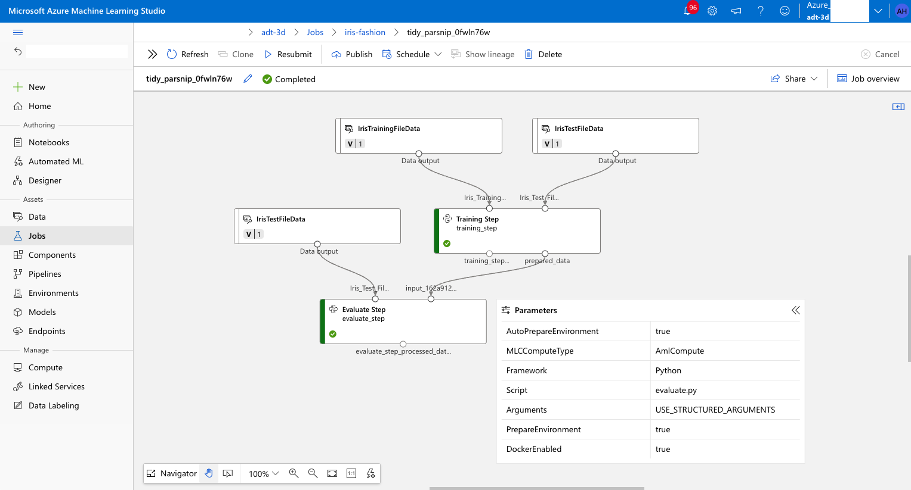
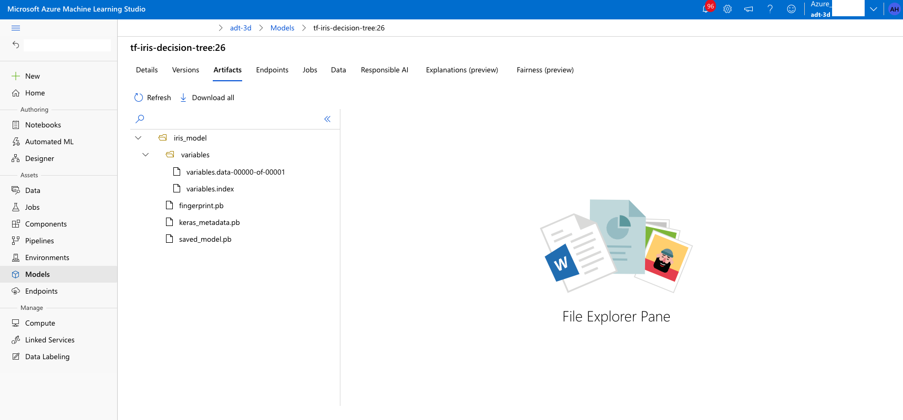

# AzureML Using Pipeline, Tensorflow, Keras and Docker with Iris as an Example
## Contents
- [Feature](#feature)
- [The file structure in the Github repository](#the-file-structure-in-the-github-repository)
- [Pipeline Jobs Metrics](#pipeline-jobs-metrics)
  - Jobs
  - Metrics
- [Models](#models)
- [Blob](#blob)
- [License](#license)

## Feature
* Send the CSV files from the edge to `Azure Blob`.
* Connect `AzureML Datastore` to `Azure Blob`.
* Read CSV data from `AzureML Datastore` and create corresponding `Dataset` object.
* Create `Azure ML PipelineData` objects to store intermediate data generated in the training and evaluation steps of the pipeline.
* Create two steps, Training Step and Evaluate Step, through `Azure ML Pipeline`. The `Training Step` is responsible for training the model and storing the generated model in the `Azure ML Models Assets` and `Azure Blob`. The `Evaluate Step` is responsible for evaluating the performance of the model using test data.

## The file structure in the Github repository
```
├── AzureML
│   ├── pipeline-python
│   │   ├── evaluate.py
│   │   └── training.py
│   └── run_iris_pipeline.ipynb
├── Blob
│   └── UploadFiles
│       ├── app.py
│       └── requirements.txt
├── Datasets
│   ├── test
│   │   └── iris_test.csv
│   └── training
│       └── iris_training.csv
├── LICENSE
└── README.md
```
## Pipeline Jobs Metrics
* Jobs ( Training Step → Evaluate Step )


* Metrics
  * Training Step
    
    
  * Evaluate Step
    
    

## Models




## Blob


## License
Examples of Azure Digital Twins is licensed under the [MIT](./LICENSE) license.